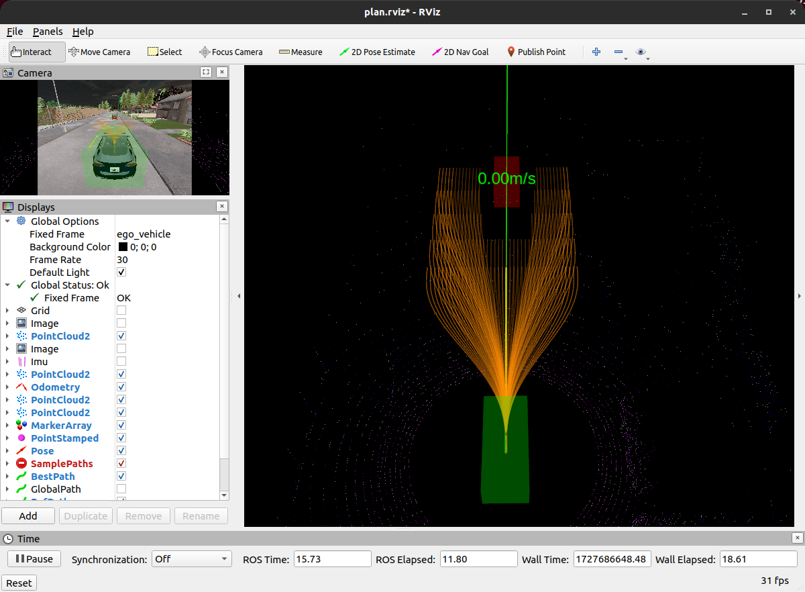

# Auto drive
个人对lattice planner和em planner学习实践的仓库，还需要更新
## lattice planner

### 避障碍物

## em planner

### 避障碍物

## 更新日志
### 2024/09/28

初版本上传

### 2024/09/30

添加em planner，调整参数，改进一些bug，整理代码，添加部分注释

## 存在的问题
- 没有比较好的控制器，在避障的时候道路本身也窄，经常会由于控制跟不上而碰撞或规划不出新路径
- lattice planner在有障碍物的时候采样路径有时很奇怪
- em planner二次规划优化出来的路径有时候效果不如不优化
- 代码还有些乱，需要整理