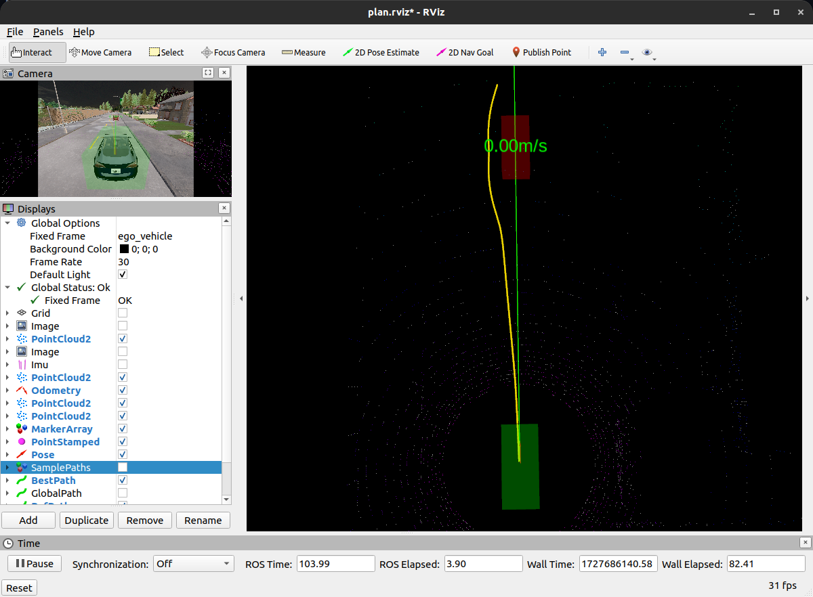

# Auto drive
个人对lattice planner和em planner学习实践的仓库，还需要更新

## 如何运行
### 前置库
- ros-carla-bridge
- osqp-eigen
- Eigen
- casadi
- ipopt

### 启动程序
- 新开终端，启动carla
- 新开终端，启动ros-carla-bridge中的 carla_ros_bridge_with_example_ego_vehicle.launch
- 新开终端，启动ros-carla-bridge中的 carla_waypoint_publisher.launch
- 新开终端，在自己的工作空间使用catkin make 或者 cmake编译该仓库 并source
- roslaunch auto_drive plan.launch

## CiLQR 
感觉用CiLQR就没必要在S-L坐标系做了，所以打算单开个仓库，还需要调试，尤其是避障还有问题，先简单放一张图吧,用casadi做的，要比Eigen的矩阵运算快很多，而且不用自己写jacobian和hessian矩阵了。

## lattice planner
### 效果演示

### 避障碍物

## em planner
### 效果演示

### 避障碍物

## 更新日志
### 2024/10/21

添加CiLQR 规划器，仅作示例

### 2024/10/09

更新注释，添加说明

### 2024/09/28

初版本上传

### 2024/09/30

添加em planner，调整参数，改进一些bug，整理代码，添加部分注释

## 存在的问题
- 没有比较好的控制器，在避障的时候道路本身也窄，经常会由于控制跟不上而碰撞或规划不出新路径
- lattice planner在有障碍物的时候采样路径有时很奇怪
- em planner二次规划优化出来的路径有时候效果不如不优化
- ~代码还有些乱，需要整理~
  
## 参考
控制器来源:https://github.com/czjaixuexi/carla_ros_bridge_pnc

B站老王:https://space.bilibili.com/287989852
